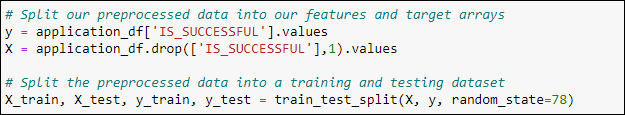
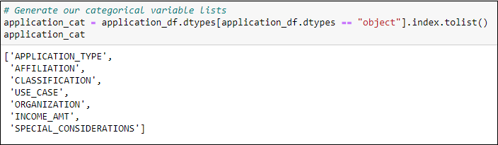
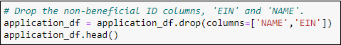
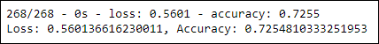
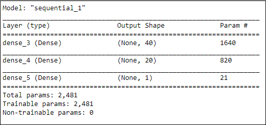
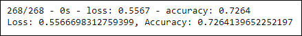
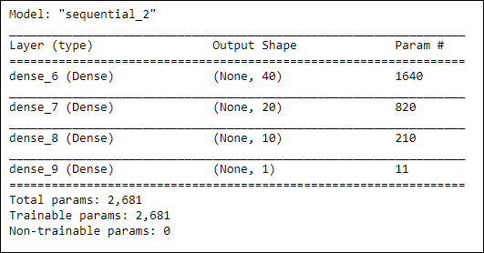
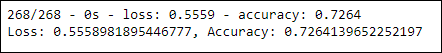
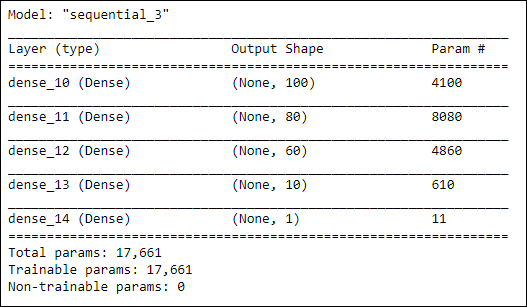

# Neural_Network_Charity_Analysis

## Project Overview

Using Machine learning and neural networks to create a binary classifier cabpable of predicting whether applicants will be successful if funded by Alphabet Soup.

## Resources

- Applications\Software: Jupyter Notebook 6.1.4
- Languages\Libraries: Python 3.8.5, pandas, scikit-learn, tensorflow
- Data: [Charity Data](charity_data.csv)

## Results

### Data Preprocessing

1. Target Variable for the model

- **IS_SUCCESSFUL** will be the target variable for this model

2. Feature Variables for the model

- **APPLICATION_TYPE, AFFILIATION, CLASSIFICATION, USE_CASE, ORGANIZATION, INCOME_AMT, SPECIAL_CONSIDERATIONS** will be the features for this model

 

3. Variables to be removed

- Non-beneficial variables of **NAME** and **EIN** will be removed from this model

 

### Compiling, Training, and Evaluating the Model

#### Original Model

- Hidden Layers: 2
- Layer 1 Nodes/Activation Feature: 90/ReLU
- Layer 2 Nodes/Activation Feature: 30/ReLU
- Output Layer Activation Feature: Sigmoid
- Epochs = 100

- The original model was was not able to achieve the target model 

The following attempts were made to increase model performance: 

#### 1. Optimized Model - Attempt 1

- Change activation features for hidden layers, decrease node count, decrease epochs:
	- Hidden Layers: 2
	- Layer 1 Nodes/Activation Feature: 40/Sigmoid
	- Layer 2 Nodes/Activation Feature: 20/Sigmoid
	- Output Layer Activation Feature: Sigmoid
	- Epochs = 10

#### 2. Optimized Model - Attempt 2

- Add hidden layer, decrease node count, decrease epochs:
	- Hidden Layers: 3
	- Layer 1 Nodes/Activation Feature: 40/ReLU
	- Layer 2 Nodes/Activation Feature: 20/ReLU
	- Layer 3 Nodes/Activation Feature: 10/ReLU
	- Output Layer Activation Feature: Sigmoid
	- Epochs = 15

#### 3. Optimized Model - Attempt 3

- Add hidden layer, decrease node count, decrease epochs:
	- Hidden Layers: 4
	- Layer 1 Nodes/Activation Feature: 100/ReLU
	- Layer 2 Nodes/Activation Feature: 80/ReLU
	- Layer 3 Nodes/Activation Feature: 60/ReLU
	- Layer 4 Nodes/Activation Feature: 10/ReLU
	- Output Layer Activation Feature: Sigmoid
	- Epochs = 20

